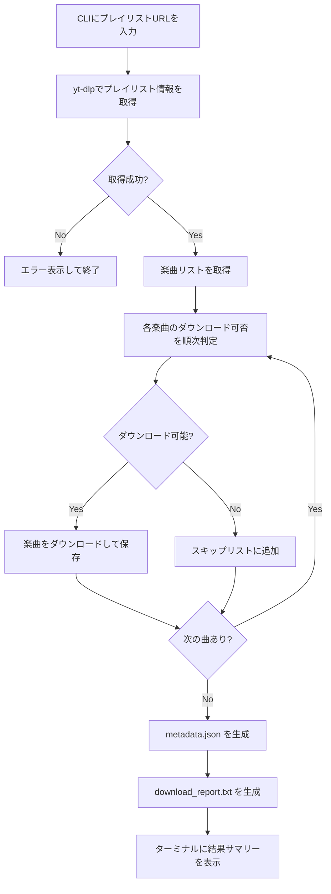

# システム要件定義書（PRD）
## moby_rakuraku_downloader

**バージョン:** 1.0.0-MVP  
**作成日:** 2026-03-01  
**ステータス:** レビュー待ち

---

## 1. プロジェクト概要

SoundCloudのプレイリストURLを入力するだけで、ダウンロード可能な楽曲を自動判定し一括ダウンロードするローカルCLIツール。楽曲制作者が参考音源を手軽に収集できることを目的とする。

---

## 2. ターゲットユーザー

| 項目 | 内容 |
|------|------|
| 主な利用者 | 楽曲制作を行う個人ユーザー（友人1名） |
| 利用目的 | 楽曲制作の参考音源収集（個人利用） |
| 技術レベル | Python環境のセットアップができる程度 |
| 利用端末 | 友人のPC（Windows / Mac / Linux いずれも対応） |

---

## 3. 解決する課題

- SoundCloudのプレイリストに含まれる楽曲は、曲ごとにダウンロード可否が異なる
- 手動で1曲ずつ確認・ダウンロードするのは非常に手間がかかる
- 「ダウンロード不可の曲はどれか」を把握したい

---

## 4. 機能要件（MVP スコープ）

### 4.1 コア機能

| # | 機能 | 詳細 |
|---|------|------|
| F-01 | プレイリスト解析 | SoundCloudのプレイリストURLからyt-dlpで全楽曲情報を取得 |
| F-02 | ダウンロード可否判定 | 各楽曲がダウンロード可能かどうかを事前判定 |
| F-03 | 一括ダウンロード | ダウンロード可能な楽曲を順次ダウンロード |
| F-04 | フォルダ整理 | プレイリスト名のフォルダを自動生成して保存 |
| F-05 | メタデータ保存 | プレイリスト・楽曲情報をJSONで記録 |
| F-06 | 結果レポート | ダウンロード結果をターミナルとtxtファイルで出力 |
| F-07 | エラースキップ | ダウンロード不可・エラー曲はスキップして続行 |

### 4.2 CLIインターフェース仕様

```bash
# 基本実行
python downloader.py <playlist_url>

# 出力先を指定
python downloader.py <playlist_url> --output ~/Music/SoundCloud

# フォーマット指定（デフォルト: mp3）
python downloader.py <playlist_url> --format mp3
```

### 4.3 ターミナル表示（richライブラリ使用）

```
🎵 moby_rakuraku_downloader
━━━━━━━━━━━━━━━━━━━━━━━━━━━━━━━━━━━
📋 プレイリスト: My Reference Tracks
🔍 楽曲数: 30曲 を解析中...

 [01/30] ████████████░░░░░░░░ 60% | Downloading: artist - title.mp3

━━━━━━━━━━━━━━━━━━━━━━━━━━━━━━━━━━━
✅ 成功:   25曲
⏭️  スキップ: 3曲  (ダウンロード不可)
❌ エラー:  2曲  (ネットワーク等)

📄 レポートを保存しました: ~/Downloads/SoundCloud/My Reference Tracks/download_report.txt
```

---

## 5. 出力ファイル構成

```
~/Downloads/SoundCloud/          ← デフォルト保存先
  └── {プレイリスト名}/
      ├── 01_artist - title.mp3
      ├── 02_artist - title.mp3
      ├── ...
      ├── metadata.json          ← プレイリスト・楽曲メタデータ
      └── download_report.txt    ← ダウンロード結果レポート
```

### metadata.json の構造

```json
{
  "playlist_url": "https://soundcloud.com/...",
  "playlist_title": "My Reference Tracks",
  "downloaded_at": "2026-03-01T13:00:00Z",
  "total_tracks": 30,
  "tracks": [
    {
      "index": 1,
      "title": "Track Title",
      "artist": "Artist Name",
      "url": "https://soundcloud.com/...",
      "status": "downloaded",
      "filename": "01_artist - title.mp3",
      "duration_seconds": 210
    },
    {
      "index": 5,
      "title": "Another Track",
      "artist": "Another Artist",
      "url": "https://soundcloud.com/...",
      "status": "skipped",
      "reason": "download_disabled"
    }
  ]
}
```

### download_report.txt の構造

```
=== Download Report ===
Date: 2026-03-01 13:00:00
Playlist: My Reference Tracks
URL: https://soundcloud.com/...

[SUCCESS] 25 tracks downloaded
[SKIPPED] 3 tracks (download disabled by artist)
[ERROR]   2 tracks (network error)

--- Skipped Tracks ---
- artist1 - title1 (download_disabled)
- artist2 - title2 (download_disabled)
- artist3 - title3 (region_restricted)

--- Error Tracks ---
- artist4 - title4 (network_timeout)
- artist5 - title5 (unknown_error)
```

---

## 6. 技術スタック

| レイヤー | 採用技術 | 理由 |
|---------|----------|------|
| 言語 | Python 3.10+ | 環境構築が容易、エコシステム豊富 |
| ダウンロードエンジン | yt-dlp | SoundCloud対応済み、コミュニティ保守、実績多数 |
| ターミナルUI | rich | プログレスバー・カラー表示・テーブル表示 |
| 音声変換 | ffmpeg（外部依存） | yt-dlpが内部で利用、フォーマット変換に必要 |
| データ保存 | JSON（標準ライブラリ） | 軽量・可読性高い |
| パッケージング | PyInstaller | Pythonスクリプトをスタンドアロン .exe に変換 |

### 依存パッケージ（requirements.txt）

```
yt-dlp>=2024.1.0
rich>=13.0.0
pyinstaller>=6.0.0
```

---

## 7. システムアーキテクチャ



---

## 8. プロジェクトファイル構成

```
moby_rakuraku_downloader/
├── downloader.py          # メインエントリーポイント・CLIハンドラー
├── build.bat              # Windows向け .exe ビルドスクリプト
├── build.sh               # Mac/Linux向け バイナリビルドスクリプト
├── requirements.txt       # 依存パッケージ一覧
├── README.md              # セットアップ手順・使い方
└── plans/
    └── PRD.md             # 本ドキュメント
```

### .exe のビルド方法（開発者向け）

```bash
# 依存インストール
pip install -r requirements.txt

# .exe をビルド（distフォルダに出力される）
pyinstaller --onefile --name moby_rakuraku_downloader downloader.py

# 出力先
dist/moby_rakuraku_downloader.exe
```

### 友人への配布方法

1. `dist/moby_rakuraku_downloader.exe` を友人に渡す
2. 友人は `.exe` をダブルクリック → ターミナルが開く
3. URLを入力してEnter → ダウンロード開始

> ⚠️ **ffmpegについて：** yt-dlpの音声変換に必要。`--onefile` オプションではffmpegを同梱できないため、友人のPCにも別途ffmpegのインストールが必要。または `ffmpeg.exe` を同じフォルダに置く方式でも対応可能。

---

## 9. エラー処理仕様

| エラー種別 | 判定方法 | 挙動 |
|-----------|---------|------|
| ダウンロード不可 | yt-dlpのメタデータ取得結果 | スキップ、レポートに `download_disabled` として記録 |
| 地域制限 | yt-dlpの例外メッセージ | スキップ、レポートに `region_restricted` として記録 |
| ネットワークエラー | yt-dlpの例外キャッチ | スキップ、レポートに `network_error` として記録 |
| プレイリストURL無効 | 初回取得時の例外 | エラーメッセージを表示して即終了 |

---

## 10. セットアップ手順（README に記載する内容）

```bash
# 1. リポジトリをクローン
git clone https://github.com/xxx/moby_rakuraku_downloader
cd moby_rakuraku_downloader

# 2. 依存パッケージをインストール
pip install -r requirements.txt

# 3. ffmpegをインストール（OS別）
# Mac: brew install ffmpeg
# Windows: https://ffmpeg.org/download.html
# Ubuntu: sudo apt install ffmpeg

# 4. 実行
python downloader.py https://soundcloud.com/user/sets/your-playlist
```

---

## 11. MVPスコープ外（将来対応候補）

以下は今回の実装スコープ外とする。metadata.json の設計はこれらの拡張を見越した構造にしている。

| 機能 | 概要 |
|------|------|
| 差分ダウンロード | 前回実行後に追加された曲だけをDL |
| 音声フォーマット選択 | mp3 / wav / flac などをオプション指定 |
| ID3タグ自動付与 | アーティスト・タイトル・アルバムアートを埋め込み |
| 複数プレイリスト対応 | URLリストファイルを渡して一括処理 |
| SoundCloud以外のサービス対応 | yt-dlpベースのため技術的には容易 |

---

## 12. 承認

このPRDの内容で実装フェーズに進む場合は承認をお願いします。

- [ ] ユーザー承認
